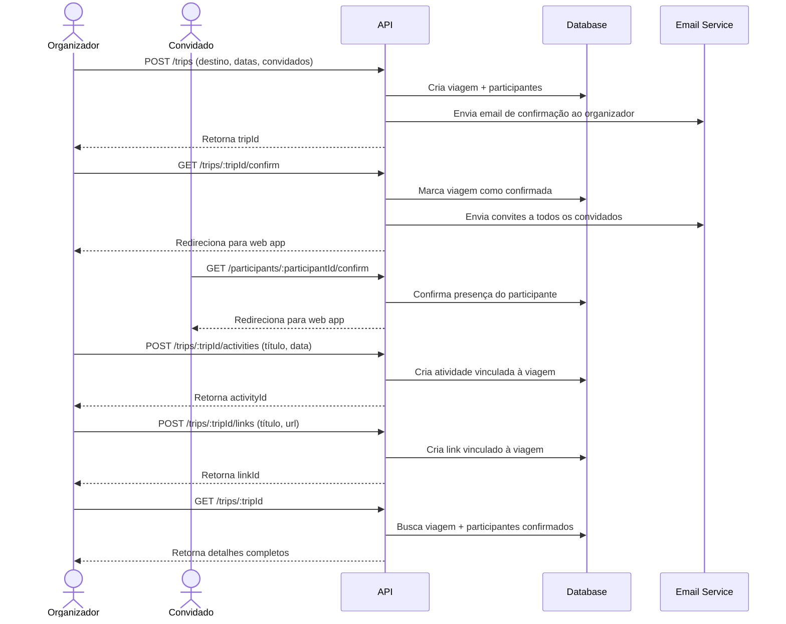

# Trip Management API

Uma API REST para gerenciamento colaborativo de viagens, permitindo criação de itinerários, convite de participantes, organização de atividades e compartilhamento de recursos entre os membros da viagem.

## Visão Geral

A aplicação implementa um fluxo completo de gestão de viagens em grupo, desde a criação inicial pelo organizador até a confirmação de presença dos participantes. O sistema utiliza notificações por email para coordenar as confirmações e garante validação de dados em todas as operações.

### Principais Capacidades

- **Gerenciamento de Viagens**: Criação, atualização e consulta de viagens com validação de datas e destinos
- **Sistema de Participantes**: Controle de organizadores e convidados com fluxo de confirmação via email
- **Organização de Atividades**: Agendamento de eventos durante o período da viagem
- **Compartilhamento de Links**: Centralização de recursos relevantes (reservas, documentos, mapas)
- **Validação Robusta**: Todas as entradas são validadas com Zod, garantindo integridade dos dados

## Arquitetura e Decisões Técnicas

### Stack Tecnológico

- **Fastify**: Framework escolhido pela performance superior e sistema de plugins modular
- **Prisma**: ORM que oferece type-safety completo e migrations versionadas
- **Zod**: Validação de schemas com inferência automática de tipos TypeScript
- **Nodemailer**: Envio de emails transacionais com suporte a templates HTML
- **SQLite**: Banco de dados leve, ideal para desenvolvimento e demonstração

### Estrutura de Dados

O modelo relacional é composto por quatro entidades principais:

```prisma
Trip (viagem principal)
  ↳ Participant[] (organizador + convidados)
  ↳ Activity[] (atividades agendadas)
  ↳ Link[] (recursos compartilhados)
```

Cada viagem possui um organizador (owner) que pode convidar participantes. Atividades e links são associados à viagem e compartilhados entre todos os membros.

## Fluxo do Sistema



### Fluxo Detalhado

1. **Criação da Viagem**: O organizador fornece destino, datas e lista de emails para convite. O sistema valida as datas (não permite datas passadas nem data de término anterior ao início) e cria a viagem com todos os participantes no banco.

2. **Confirmação pelo Organizador**: Um email com link de confirmação é enviado ao organizador. Ao confirmar, a viagem é marcada como ativa e dispara emails de convite para todos os convidados.

3. **Confirmação dos Participantes**: Cada convidado recebe um email com link único. A confirmação registra a presença do participante no sistema.

4. **Gestão Colaborativa**: Com a viagem confirmada, organizador e participantes podem adicionar atividades e links, visíveis para todo o grupo.

## Endpoints Principais

### Viagens
- `POST /trips` - Cria nova viagem e envia email ao organizador
- `GET /trips/:tripId/confirm` - Confirma viagem e notifica convidados
- `GET /trips/:tripId` - Retorna detalhes da viagem com participantes confirmados
- `PUT /trips/:tripId` - Atualiza destino ou datas da viagem

### Participantes
- `POST /trips/:tripId/invites` - Adiciona novo convidado e envia email
- `GET /participants/:participantId/confirm` - Confirma presença do participante
- `GET /trips/:tripId/participants` - Lista todos os participantes
- `GET /participants/:participantId` - Retorna dados específicos de um participante

### Atividades e Links
- `POST /trips/:tripId/activities` - Agenda nova atividade
- `GET /trips/:tripId/activities` - Lista atividades por data
- `POST /trips/:tripId/links` - Adiciona novo link
- `GET /trips/:tripId/links` - Lista todos os links da viagem

## Configuração e Execução

### Pré-requisitos

- Node.js 18+
- npm ou yarn

### Variáveis de Ambiente

Crie um arquivo `.env` na raiz do projeto:

```bash
DATABASE_URL="file:./dev.db"
API_BASE_URL="http://localhost:3333"
WEB_BASE_URL="http://localhost:3000"
PORT=3333
```

### Instalação

```bash
# Instalar dependências
npm install

# Executar migrations do banco de dados
npm run db:migrate

# Iniciar servidor em modo de desenvolvimento
npm run dev
```

O servidor estará disponível em `http://localhost:3333`.

### Utilitários de Desenvolvimento

```bash
# Interface visual do banco de dados
npm run db:studio

# Criar nova migration
npm run db:migrate
```

## Validação e Tratamento de Erros

A aplicação implementa validação em múltiplas camadas:

- **Validação de Schema**: Zod valida formato de emails, UUIDs, datas e strings mínimas
- **Validação de Negócio**: Verifica datas válidas (não permite viagens no passado ou com término antes do início)
- **Tratamento Centralizado**: Error handler customizado retorna mensagens claras para o cliente

Exemplo de validação:
```typescript
// Não permite data de início no passado
if(dayjs(starts_at).isBefore(new Date())){
  throw new ClientError("Invalid trip start date.");
}

// Não permite data de término antes do início
if(dayjs(ends_at).isBefore(starts_at)){
  throw new ClientError("Invalid trip end date.");
}
```

## Sistema de Notificações

Emails são enviados em momentos estratégicos:

1. **Criação da viagem** → Email ao organizador com link de confirmação
2. **Confirmação da viagem** → Emails em paralelo para todos os convidados
3. **Novo convite** → Email individual ao participante adicionado

Os emails utilizam templates HTML responsivos e incluem todas as informações relevantes (destino, datas formatadas, links de ação).

## Possíveis Evoluções

- Implementação de autenticação JWT para controle de acesso
- Sistema de permissões (somente organizador pode modificar viagem)
- Upload de documentos e imagens
- Notificações em tempo real via WebSocket
- Sincronização com calendários externos (Google Calendar, Outlook)
- Estimativa de custos compartilhados entre participantes
- Chat entre membros da viagem
- Versão mobile (React Native / Flutter)

## Estrutura do Projeto

```
src/
├── routes/           # Endpoints da API organizados por recurso
├── lib/              # Configurações (Prisma, Nodemailer, Day.js)
├── errors/           # Classes de erro customizadas
├── env.ts            # Validação de variáveis de ambiente
├── error-handler.ts  # Middleware de tratamento de erros
└── server.ts         # Configuração e inicialização do Fastify

prisma/
├── schema.prisma     # Definição do modelo de dados
└── migrations/       # Histórico de alterações no banco
```

## Licença

ISC

---

**Desenvolvido com TypeScript, Fastify e Prisma**
